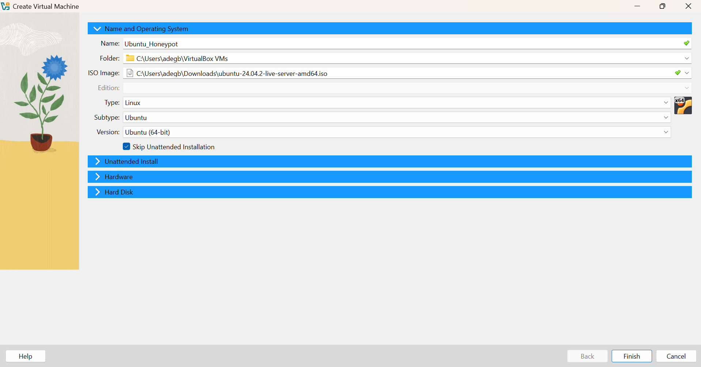
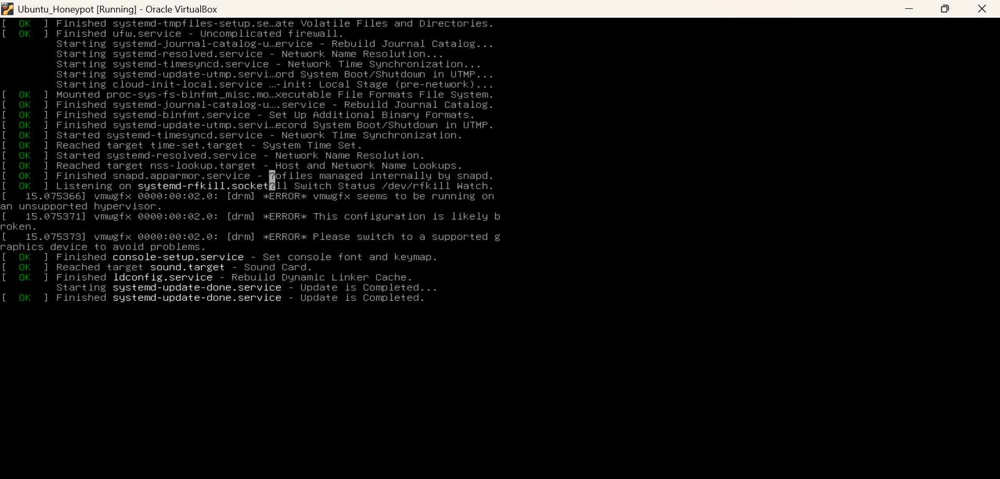
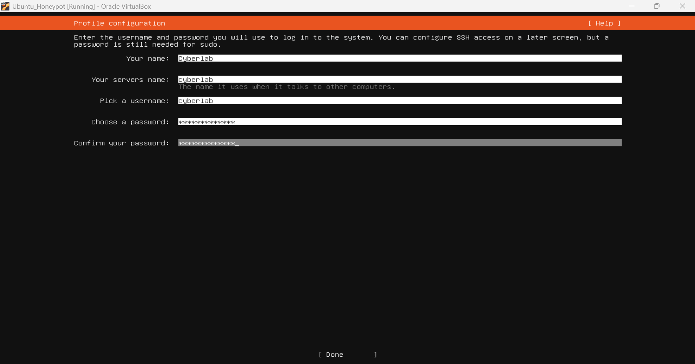
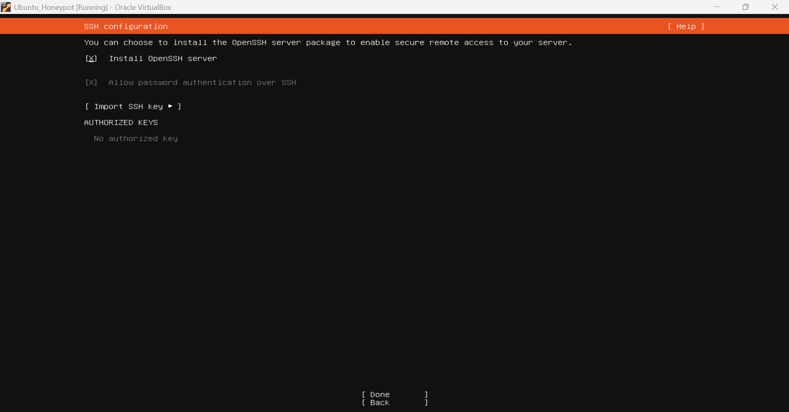
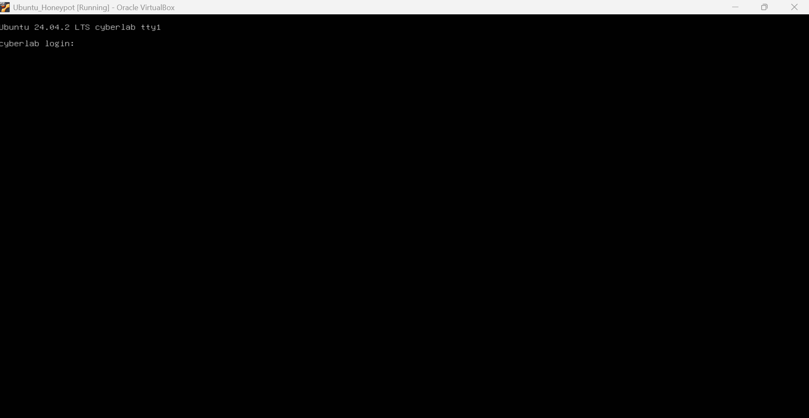
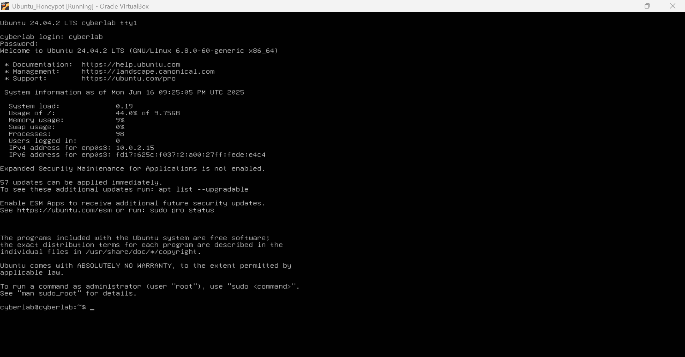

# 🛠️ Cowrie Honeypot Setup Documentation

## Step 1: Create Virtual Machine in VirtualBox


## Step 2: Ubuntu Server Install






## Step 3: Install Dependencies
sudo apt update && sudo apt upgrade -y
sudo apt install git python3-pip python3-venv libssl-dev libffi-dev build-essential libpython3-dev libevent-dev authbind -y

## Step 4: Create Cowrie User
sudo adduser --disabled-password cowrie
sudo su - cowrie

## Step 5: Clone and install Cowrie
git clone https://github.com/cowrie/cowrie.git
cd cowrie
python3 -m venv cowrie-env
source cowrie-env/bin/activate
pip install --upgrade pip
pip install -r requirements.txt

## Step 6: Configure Cowrie
cp etc/cowrie.cfg.dist etc/cowrie.cfg
nano etc/cowrie.cfg  # change hostname to 'ubuntu-honeypot'

## Step 7: Start Cowrie
bin/cowrie start
bin/cowrie status

## Step 8: Identify IP Address
ip a

## Step 9: Simulate SSH Attack from Kali
ssh -p 2222 root@<honeypot-ip>

## Step 10: View Cowrie Logs
tail -f cowrie.log


---

# 📊 analysis.md

```markdown
# 📊 Cowrie Log Analysis

## Summary

Cowrie successfully captured SSH login attempts and simulated shell commands from a Kali Linux VM. Logs were reviewed using `tail -f cowrie.log`.

## Sample Log Highlights

- Login attempt with: `root/123456`
- Commands issued:
  - `ls`
  - `whoami`
  - `cat /etc/passwd`

### Observed Log Output


## Lessons Learned

- Cowrie is highly effective at mimicking SSH
- Honeypots provide visibility into attacker patterns
- Simulating attacks in a controlled environment is safe and valuable for training

